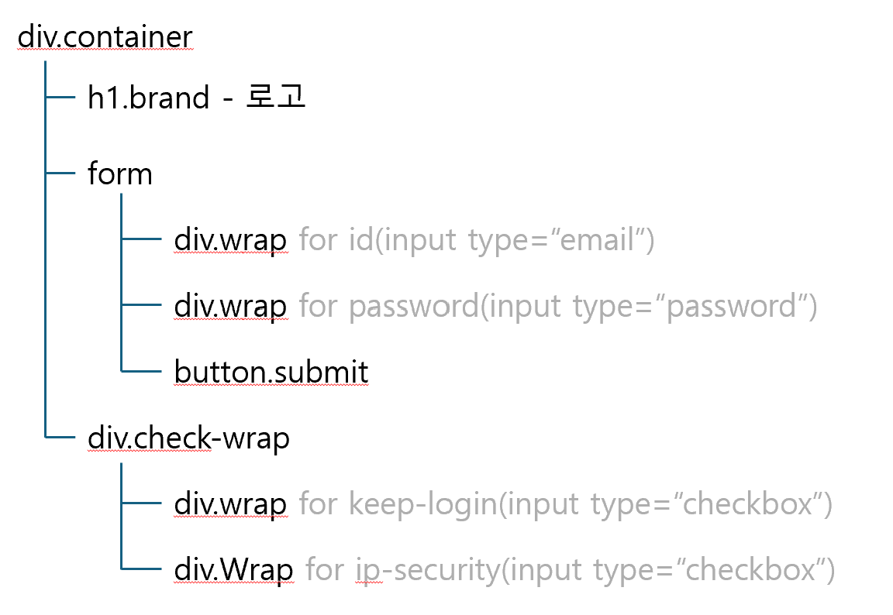

# 24.10.11 - Naver 로그인 폼

- [완성본](https://dev-jiyoung-oh.github.io/homework/login/login.html)

## 마크업&스타일링

### 마크업 구조



### 로그인 폼

```html
<form class="login-form">
  <div class="login-input-wrap">
    <label for="login-id" class="login__label-id sr-only">아이디(이메일)</label>
    <input type="email" class="login__input-id" placeholder="아이디(이메일)" name="login-id" id="login-id" required />
    <span class="login__id-error">아이디는 이메일 형식으로 입력해 주세요</span>
  </div>

  <div class="login-input-wrap">
    <label for="login-password" class="login__label-password sr-only">비밀번호</label>
    <input type="password" class="login__input-password" placeholder="비밀번호" name="login-password" id="login-password" required minlength="10" />
    <span class="login__password-error">비밀번호는 10자리 이상 입력해 주세요</span>
  </div>

  <button type="submit" class="login-submit-button">로그인</button>
</form>
```

```css
/* input 에러 메시지 */
.login__input-id:user-invalid + .login__id-error,
.login__input-password:user-invalid + .login__password-error {
  display: block;
}
```

- input, label, span(에러문구 표시용)을 하나의 컴포넌트로 묶고자 div로 감싸주었습니다.
- 사용자가 입력한 값에 따라 에러메시지를 표시/미표시 하기 때문에 :user-invalid 가상 클래스를 이용하여 작업했습니다.

### 체크박스

```html
<div class="keep-check">
  <input type="checkbox" class="login__input-keep-check" name="login-keep-check" id="login-keep-check" />
  <label for="login-keep-check" class="login__label-keep-check">로그인 상태 유지</label>
</div>
```

```css
/* 로그인 상태 유지 */
.keep-check {
  display: flex;
  float: right;
  align-items: center;

  .login__input-keep-check {
    /* width, height, margin 생략 */
    background: url(./../../assets/login/unchecked.svg) no-repeat center / 100%;
    appearance: none;
    cursor: pointer;
  }
  .login__input-keep-check:checked {
    background: url(./../../assets/login/checked.svg) no-repeat center / 100%;
  }
  .login__label-keep-check {
    cursor: pointer;
  }

  @media (min-width: 768px) {
    float: left;
  }
}
```

- 검색해보니 네이티브로 지원되는 모양들을 해제하는 속성(appearance: none;)이 있어 해당 처리를 하고 백그라운드 이미지로 체크박스 svg파일을 이용했습니다.
- 미디어 쿼리를 이용하여 모바일 환경(768px 미만)에서는 오른쪽에 표시되고, 데스크탑 환경(768px 이상)에서는 왼쪽에 표시되게끔 처리하였습니다.

```html
<div class="ip-security-check">
  <a href="./pages/ip_security.html" target="_blank" class="ip-security-url" title="네이버 보안 로그인 설정 페이지로 이동">IP 보안</a>
  <input type="checkbox" class="login__input-ip-security-check sr-only" name="login-ip-security-check" id="login-ip-security-check" />
  <label for="login-ip-security-check" class="login__label-ip-security-check"></label>
</div>
```

```css
.ip-security-check {
  display: none;

  @media (min-width: 768px) {
    display: block;
    float: right;

    .login__label-ip-security-check {
      /* 폰트 컬러, 굵기...생략 */
      cursor: pointer;
    }
    .login__input-ip-security-check + .login__label-ip-security-check::after {
      content: "OFF";
    }
    .login__input-ip-security-check:checked + .login__label-ip-security-check::after {
      content: "ON";
      color: var(--green);
    }
  }
}
```

- ip 보안 체크의 경우 모바일 환경(768px 미만)에서는 보이지 않으므로 기본적으로 display 속성값을 none으로 해놓고, 데스크톱 환경에서는 보이므로 미디어 쿼리를 이용해 768px 이상일 때 display 속성값을 block으로 변경되게끔 하였습니다.
- 가상요소 ::after를 이용하여 ip 보안 체크박스의 값에 따라 체크박스 라벨에 content속성값을 ON/OFF로 설정하였습니다.

## 과제를 마치며

- 생각했던 것보다 웹접근성을 고려하는데 신경쓸 게 많아서 시간이 오래걸렸습니다.
- 컴포넌트화를 하려고 노력하였으나 쓸데없는 건 아닌지, 제대로 한 게 맞는지 확신이 들지 않습니다.
- BEM 패턴으로 네이밍 작업을 하려고 했으나 제대로 했는지 모르겠습니다.
- 스스로 생각하기에 저 자신의 코드가 보기 힘들다는 생각이 듭니다.
